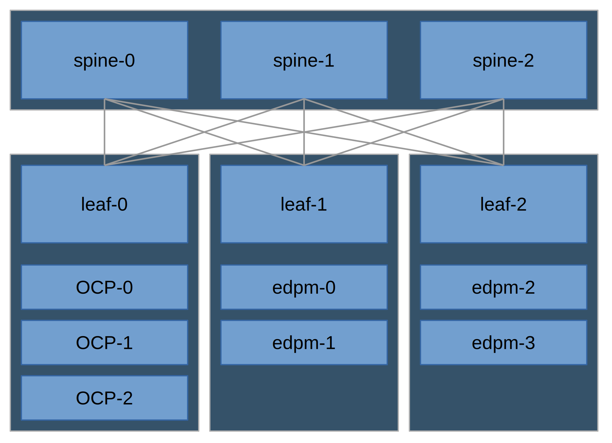

# Deployed Topology - BMO spine-and-leaf

Spine and Leaf topology of Red Hat OpenStack Services on OpenShift, with
dataplane nodes deployed with Baremetal Operator. It contains a collection
of custom resources (CRs) for deploying the test environment.

## Purpose

This topology is used for testing Baremetal Operator node provisioning in a
spine-and-leaf architecture.

### Nodes

| Role              | Machine Type | Count |
| ----------------- | ------------ | ----- |
| Compact OpenShift | vm           | 3     |
| OpenStack Compute | vm           | 4     |

### Networks

| Name         | Type     | Interface | CIDR            |
| ------------ | -------- | --------- | --------------- |
| Provisioning | untagged | nic1      | 172.22.0.0/24   |
| Machine      | untagged | nic2      | 192.168.32.0/20 |
| RH OSP       | trunk    | nic3      |                 |
| RH OSP       | trunk1               |                 |
| RH OSP       | trunk1               |                 |

#### Networks in RH OSP

| Name        | Type        | CIDR                                                 |
| ----------- | ----------- | ---------------------------------------------------- |
| ctlplane    | untagged    | 192.168.122.0/24, 192.168.123.0/24, 192.168.123.0/24 |
| internalapi | VLAN tagged | 172.17.0.0/24, 172.17.1.0/24, 172.17.1.0/24          |
| storage     | VLAN tagged | 172.18.0.0/24, 172.18.0.0/24, 172.18.0.0/24          |
| tenant      | VLAN tagged | 172.19.0.0/24, 172.19.0.0/24, 172.19.0.0/24          |

#### Router addresses

| Network     | leaf-0        | leaf-1        | leaf-2        |
| ----------- | ------------- | ------------- | ------------- |
| ctlplane    | 192.168.122.1 | 192.168.123.1 | 192.168.124.1 |
| internalapi | 172.17.0.1    | 172.17.1.1    | 172.17.2.1    |
| storage     | 172.18.0.1    | 172.18.1.1    | 172.18.2.1    |
| tenant      | 172.19.0.1    | 172.19.1.1    | 172.19.2.1    |

#### Dataplane node baremetal provisioning network

The OCP external network (``machine network``) is used for provisioning, and 
connections to the RH OSP ``ctlplane`` network is also on the OCP nodes. To
avoid asymmetric routing during dataplane node provisioning, additional IP
ranges (``192.168.130.0/24`` and ``192.168.131.0/24``) are used for the Metal3
deploy ramdisk.

### Services, enabled features and configurations

| Service          | configuration    | Lock-in coverage?  |
| ---------------- | ---------------- | ------------------ |
| Cinder           | LVM/iSCSI/lioadm |                    |
| Glance           | Swift            |                    |
| Swift            | (default)        |                    |
| Neutron          | OVN              |                    |
| Nova             | (default)        |                    |
| Keystone         | (default)        |                    |

## Workflow

1. [Install the OpenStack K8S operators and their dependencies](../../common/README.md)
2. [Configure and deploy the OpenStack control plane](control-plane.md)
3. [Configure and deploy the OpenStack data plane](data-plane.md)
